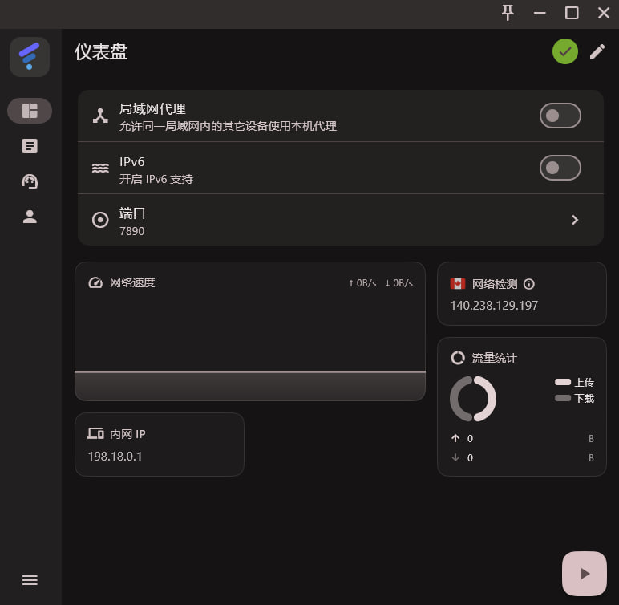
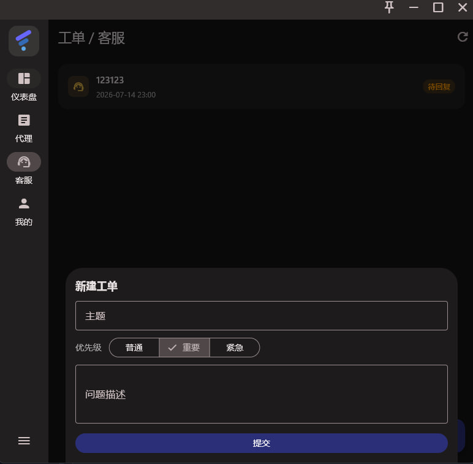
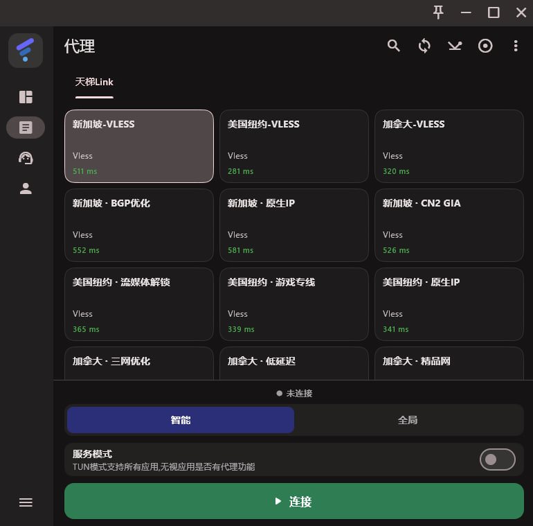
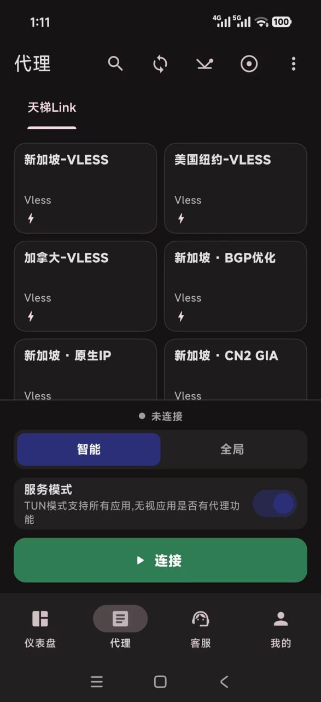

# TianTiLink 天梯

[**简体中文**](README_zh_CN.md)

  

**高速 VPN · 梯子 · 代理加速器 · 一键科学上网**

A fast & secure multi-platform VPN / proxy client — one-tap connect, ClashMeta-based, low latency, ad-free.

## 📥 下载 Download

- 🌐 **官网直下(推荐)**:**https://tiantilink.com** — Android / Windows / macOS 一键下载
- 📱 **iOS**:前往 [tiantiweb.xyz/dl/app.html](https://tiantiweb.xyz/dl/app.html) **一键导入订阅**(免费客户端,加到主屏即用)
- 📦 GitHub Releases:**https://github.com/TianTiLink/FlClash/releases**

## 🤝 推广赚钱

把 TianTiLink 分享给好友,他们注册购买后,你按**后台代理提成比例**拿提成——自己用得爽、顺便还能赚。想做代理 / 拿更高比例,联系 Telegram [@DBglobal1](https://t.me/DBglobal1)。

## 💻 预览 Preview

**桌面 Desktop**

  
  
  

**手机 Mobile**

## ✨ 特性 Features

- ✈️ 多平台:Android / iOS / Windows / macOS(iOS 一键导入订阅)
- 🚀 基于 ClashMeta 内核,低延迟、稳定不掉线、安全加密、无广告
- 💻 自适应多屏,多彩主题,Material You 设计

## ⭐ Star

觉得好用,点个 Star 支持一下 👇

    

---

本项目基于开源项目 [FlClash](https://github.com/chen08209/FlClash)(ClashMeta GUI 客户端)二次开发,遵循 [GPL-3.0](LICENSE) 协议开源。
